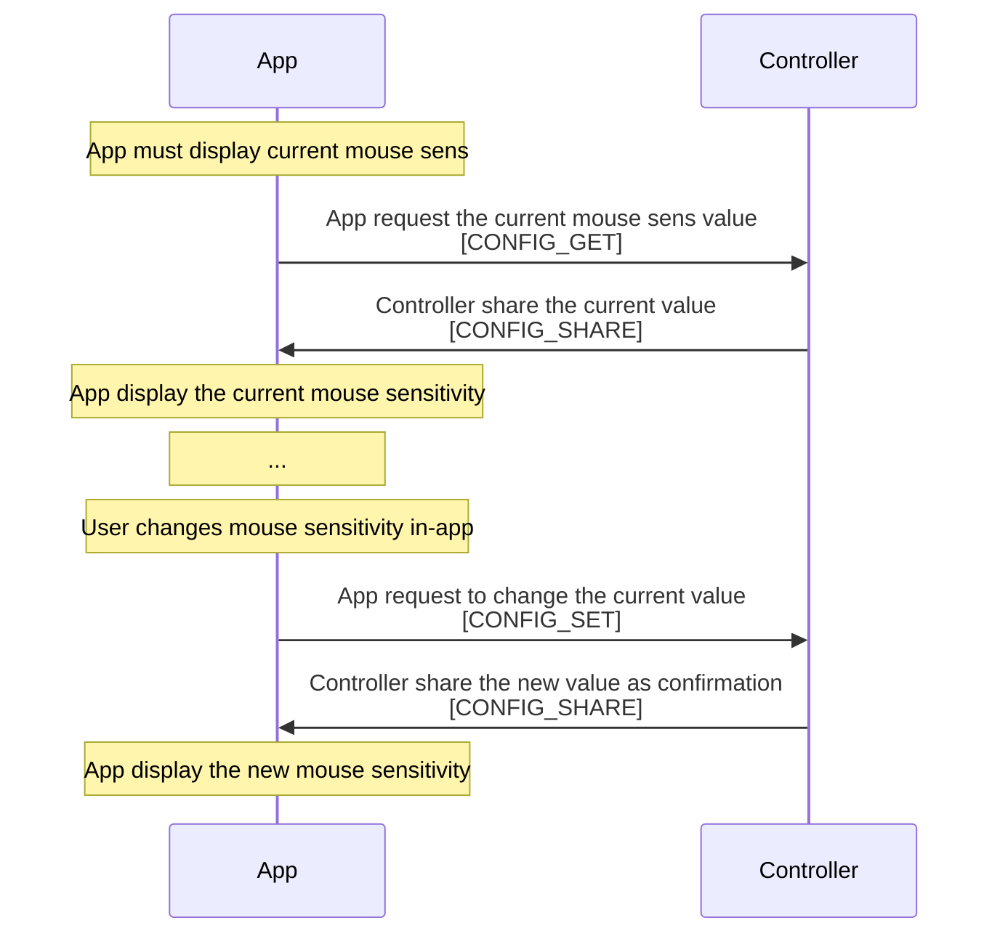

# Ctrl protocol

## Introduction

The Ctrl protocol is a minimalistic bidirectional communication protocol between the controller and the web app, using USB (WebUSB). For the purpose of exchanging data such as logging, configuration settings and profile mappings.

The exchange is performed with discrete packages of at most 64 bytes.

Both sides of the communication (USB host and USB device) are equally-levelled actors from the point of view of the protocol, both sides can initiate the communication (send a message) at any time.

There is no acknowledge when receiving messages at protocol level, though some messages could trigger a response message from the other side. In such cases the response message is asynchronous, and can happen at any time later or not happen at all. Is up to the "receiver" to determine adequate timeout values.

Verification and error correction is provided by the USB protocol.

Padding zeros to complete the 64 bytes may be used. Therefore the protocol avoids using zero as indexes for any of its enums.

## Package general structure

| Byte 0 | 1 | 2 | 3 | 4~63 |
| - | - | - | - | - |
| Protocol version | Device Id | Message type | Payload size | Payload

### Protocol version

| Key | Index |
| - | - |
| VERSION 1 | 1 |

### Device id

| Key | Index |
| - | - |
| ALPAKKA | 1
| KAPYBARA | 2

### Message type

| Key | Index |
| - | - |
LOG | 1
PROC | 2
CONFIG_GET | 3
CONFIG_SET | 4
CONFIG_SHARE | 5
PROFILE_GET | 10
PROFILE_SET | 11
PROFILE_SHARE | 12

### Procedure index
Procedure index as defined in [hid.h](/src/headers/hid.h).

### Config index
| Key        | Index |
| -          | -     |
| PROTOCOL   | 1
| SENS_TOUCH | 2
| SENS_MOUSE | 3
| DEADZONE   | 4

### Section index
| Key              | Index |
| -                | -     |
| NAME             | 1
| A                | 2
| B                | 3
| X                | 4
| Y                | 5
| DPAD_LEFT        | 6
| DPAD_RIGHT       | 7
| DPAD_UP          | 8
| DPAD_DOWN        | 9
| SELECT_1         | 10
| START_1          | 11
| SELECT_2         | 12
| START_2          | 13
| L1               | 14
| R1               | 15
| L2               | 16
| R2               | 17
| L4               | 18
| R4               | 19
| DHAT_LEFT        | 20
| DHAT_RIGHT       | 21
| DHAT_UP          | 22
| DHAT_DOWN        | 23
| DHAT_UL          | 24
| DHAT_UR          | 25
| DHAT_DL          | 26
| DHAT_DR          | 27
| DHAT_PUSH        | 28
| ROTARY_UP        | 29
| ROTARY_DOWN      | 30
| THUMBSTICK       | 31
| THUMBSTICK_LEFT  | 32
| THUMBSTICK_RIGHT | 33
| THUMBSTICK_UP    | 34
| THUMBSTICK_DOWN  | 35
| THUMBSTICK_PUSH  | 36
| THUMBSTICK_INNER | 37
| THUMBSTICK_OUTER | 38
| GLYPHS_0         | 39
| GLYPHS_1         | 40
| GLYPHS_2         | 41
| GLYPHS_3         | 42
| DAISY_0          | 43
| DAISY_1          | 44
| DAISY_2          | 45
| DAISY_3          | 46
| GYRO             | 47
| GYRO_X           | 48
| GYRO_Y           | 49
| GYRO_Z           | 50
| MACRO_1          | 51
| MACRO_2          | 52
| MACRO_3          | 53
| MACRO_4          | 54

### Section data
Section structs as defined in [ctrl.h](/src/headers/ctrl.h).

## Log message
Message output by the firmware, as strings of arbitrary size.

Direction: `Controller` -> `App`

| Byte 0 | 1 | 2 | 3 | 4~63 |
| - | - | - | - | - |
| Protocol version | Device Id | Message type | Payload size | Payload
|                  |           | LOG          | 1-60         | Log message

## Proc message
Trigger a procedure (eg: calibration) on the controller.

Direction: `Controller` <- `App`

| Byte 0 | 1 | 2 | 3 | 4 |
| - | - | - | - | - |
| Version | Device Id | Message type | Payload size | Payload
|         |           | PROC         | 1            | PROC INDEX

## Config GET message
Request the current value of some specific configuration parameter.

Direction: `Controller` <- `App`

| Byte 0 | 1 | 2 | 3 | 4 |
| - | - | - | - | - |
| Version | Device Id | Message type | Payload size | Payload
|         |           | CONFIG_GET   | 1            | CONFIG INDEX

## Config SET message
Change the value of some specific configuration parameter.

Direction: `Controller` <- `App`

| Byte 0 | 1 | 2 | 3 | 4 | 5 | 6~10
| - | - | - | - | - | - | - |
| Version | Device Id | Message type | Payload size | Payload      | Payload       | Payload
|         |           | CONFIG_SET   | 6            | CONFIG INDEX | PRESET INDEX  | PRESETS VALUE

## Config SHARE message
Notify the current value of some specific configuration parameter.

Direction: `Controller` -> `App`

| Byte 0 | 1 | 2 | 3 | 4 | 5 | 6~10 |
| - | - | - | - | - | - | - |
| Version | Device Id | Message type | Payload size | Payload      | Payload       | Payload
|         |           | CONFIG_SHARE | 6            | CONFIG INDEX | PRESET INDEX  | PRESETS VALUE

## Profile GET message
Request the current value of some specific profile section.

Direction: `Controller` <- `App`

| Byte 0  | 1         | 2            | 3            | 4             | 5 |
| -       | -         | -            | -            | -             | - |
| Version | Device Id | Message type | Payload size | Payload       | Payload
|         |           | PROFILE_GET  | 2            | PROFILE INDEX | SECTION INDEX

## Profile SET message
Change the value of some specific profile section.

Direction: `Controller` <- `App`

| Byte 0  | 1         | 2            | 3            | 4             | 5             | 6~64 |
| -       | -         | -            | -            | -             | -             | -    |
| Version | Device Id | Message type | Payload size | Payload       | Payload       | Payload
|         |           | PROFILE_SET  | 58           | PROFILE INDEX | SECTION INDEX | SECTION DATA

## Profile SHARE message
Notify the current value of some specific profile section.

Direction: `Controller` -> `App`

| Byte 0  | 1         | 2              | 3            | 4             | 5             | 6~64 |
| -       | -         | -              | -            | -             | -             | -    |
| Version | Device Id | Message type   | Payload size | Payload       | Payload       | Payload
|         |           | PROFILE_SHARE  | 58           | PROFILE INDEX | SECTION INDEX | SECTION DATA

## Example of config interchange

