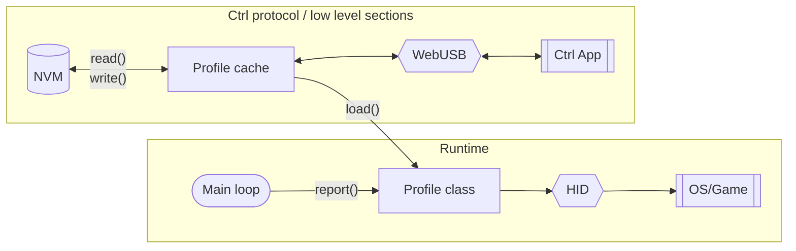

# Profile lifecycle

```mermaid
flowchart LR
    subgraph Runtime
        Loop(["Main loop"])
        Profile["Profile class"]
        HID{{"HID"}}
        OS[["OS/Game"]]
    end
    subgraph Ctrl protocol / low level sections
        NVM[("NVM")]
        Cache["Profile cache"]
        WebUSB{{"WebUSB"}}
        Ctrl[["Ctrl App"]]
    end

    NVM <--read()<br>write()--> Cache
    Cache --load()--> Profile
    Cache <--> WebUSB
    WebUSB <--> Ctrl
    Profile --> HID
    HID --> OS
    Loop --report()--> Profile
```
